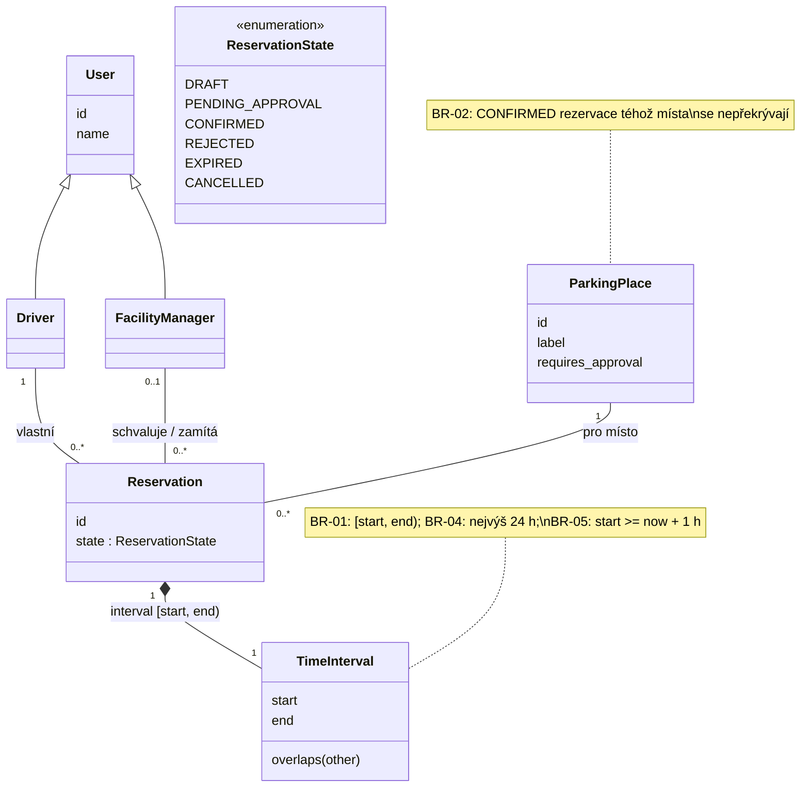
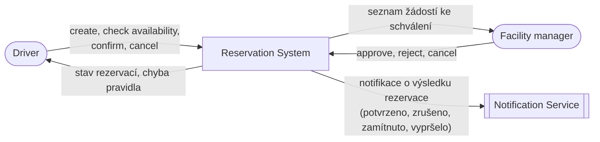
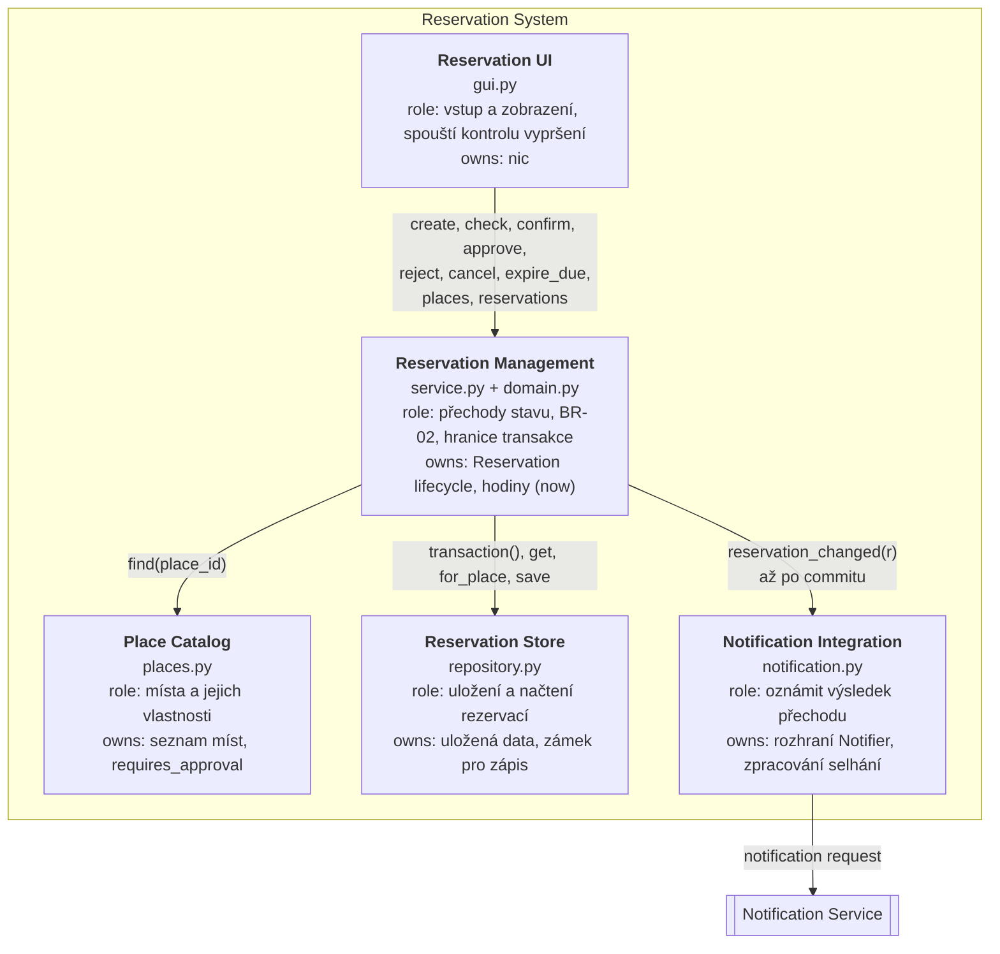
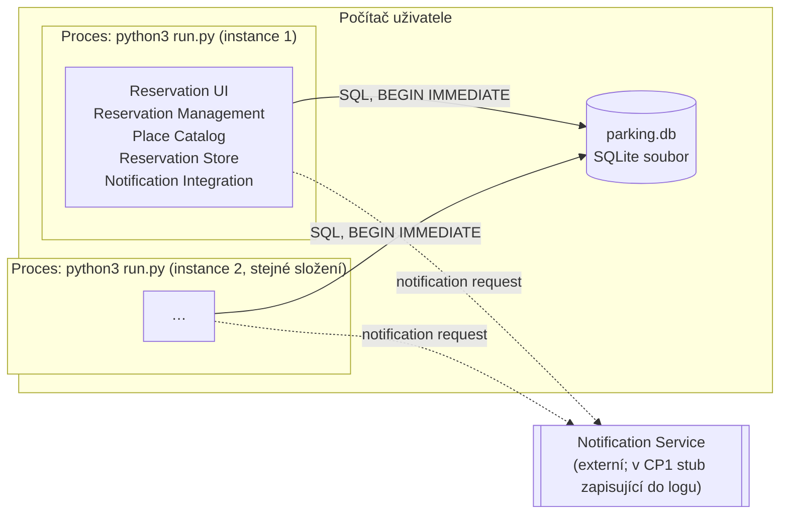

# Architecture and decisions

## Overview

```
tests/            → exercise domain rules and persistence
src/parking/
  domain.py       → ParkingPlace, User, Reservation, State + business rules
  repository.py   → SQLite persistence of reservations
```

The domain module has no I/O. The repository stores and loads reservations;
rule checks that need existing data (overlap) take the loaded reservations
as input. The Notification Service boundary will be a small interface in
the domain with a stub implementation (not in C01).

## Decisions

### D1 – Python, standard library only
Chosen over Java + Spring Boot because the whole team knows Python, nothing
has to be installed, and a clean checkout runs with one command. Cost: no
framework for the later HTTP layer; we will add one (FastAPI or Flask) when
the walking skeleton needs it.

### D2 – SQLite as the database
Zero configuration, file-based, ships with Python. Sufficient for CP1 and
for the expected load of a single car park. Revisit if the *Unknown* in the
Project Frame turns out badly.

### D3 – Times stored as UTC ISO-8601 strings
SQLite has no datetime type. The C01 spike (`docs/evidence-and-evolution.md`)
showed that `isoformat()` / `fromisoformat()` round-trips timezone-aware
datetimes losslessly, so no custom adapters are used.

---

# C03 — Architektura

Navazuje na Specification Baseline v0.2 (`docs/specification.md`) a na
drivery AD-01 a AD-02 z C02.

**Zvolený scénář:** OP-03 Confirm na místě se schválením (`VIP-01`)
→ `PENDING_APPROVAL` → později OP-05 Approve / Reject / Expire.
**Komplikace:** souběh. Dvě překrývající se žádosti téhož místa schvaluje
manažer ve dvou instancích aplikace současně (REQ-04, REQ-06).

## Část A — AS-IS (mapování současné implementace)

Stav kódu na commitu `bb72a77` (konec C02).

| Prvek (soubor) | Co dnes dělá | Jaký stav drží | Na čem závisí |
|---|---|---|---|
| `gui.py` `App` | formulář a tabulka, **skládá use-casy**: vybere místo, dodá `now`, zavolá doménovou funkci uvnitř `repo.apply(...)`, spouští vypršení | pevný seznam míst `PLACES` | `domain`, `repository` |
| `domain.py` | pravidla BR-01..BR-05, přechody `confirm`, `approve`, `reject`, `cancel`, `expire_if_due` | — (čisté funkce, bez I/O) | nic |
| `repository.py` `ReservationRepository` | SQLite, `save`/`get`/`for_place`, `apply(id, operation)` provede předanou operaci pod `BEGIN IMMEDIATE` | tabulka `reservation` | `domain` |
| `run.py` | spustí GUI nad souborem `parking.db` | — | `gui` |

Průchod scénářem v kódu (Approve):
`App.approve` ([gui.py:135](../src/parking/gui.py#L135)) → `repo.apply(rid, lambda r, existing: approve(r, existing, now))`
→ `BEGIN IMMEDIATE` → `get` + `for_place` → `domain.approve` (kontrola BR-02,
`state = CONFIRMED`) → `save` → `COMMIT`.

**Nálezy:**

- **F1 — Use-case řídí GUI.** Které pravidlo se zavolá, s jakým místem a
  jakým `now`, rozhoduje `App` ([gui.py:129-151](../src/parking/gui.py#L129-L151)).
  Aplikační vrstva neexistuje.
- **F2 — Atomičnost drží repozitář, ale jen když ho klient použije správně.**
  `repo.apply` ([repository.py:38](../src/parking/repository.py#L38)) přijme libovolný
  callback. `App.create` a `App.check` volají `save` / `for_place` mimo něj.
  Kdo zavolá `domain.confirm` mimo `apply`, poruší REQ-04, a nic ho nezastaví.
- **F3 — Katalog míst je v GUI.** `PLACES` včetně `requires_approval`
  ([gui.py:12](../src/parking/gui.py#L12)). Jiný klient by ho musel zkopírovat.
- **F4 — Vypršení spouští jen obnovení tabulky.** `refresh()`
  ([gui.py:93-100](../src/parking/gui.py#L93-L100)). Když nikdo GUI neobnoví,
  `PENDING_APPROVAL` po `start` visí (REQ-08).
- **F5 — Notification Service chybí.** Je jen v Project Frame (C01). V kódu
  není rozhraní ani volání.
- **F6 — Role se nerozlišují.** Approve může stisknout kdokoli. Doména ani
  GUI nezná Facility managera.

## B. Architektonické drivery

| ID | Podklad / zdroj | Proč ovlivňuje architekturu | Otázka, kterou musí architektura vyřešit |
|---|---|---|---|
| AD-01 | BR-02, REQ-04, REQ-06, Část A F2 | dva souběžné požadavky (Confirm/Approve) mohou oba vidět „bez kolize“; dnes BR-02 platí jen proto, že GUI volá `repo.apply` | kde se dělá autoritativní rozhodnutí o potvrzení a kde leží hranice transakce, aby BR-02 platilo pro každého klienta? |
| AD-02 | REQ-06..REQ-08, OP-05, Část A F4 | rozhodnutí manažera přichází později, stav musí přežít konec požadavku i zavření aplikace; vypršení závisí jen na čase | kdo vlastní stav `PENDING_APPROVAL` a kdo provádí pozdější přechod (approve / reject / expire)? |
| AD-03 | Project Frame „External boundary“ (C01), Část A F5 | změna stavu je uložená dřív, než se odešle notifikace; Notification Service může selhat | má selhání notifikace změnit výsledek Confirm/Approve a kdo řeší opakování? |
| AD-04 | README CP1 (`POST /reservations`), Část A F1, F3 | přibude druhý klient (HTTP); logika složená v GUI by se musela zkopírovat a mohla by se rozejít | kde musí žít řízení use-casů a katalog míst, aby se všichni klienti chovali stejně? |

AD-01 a AD-02 jsou z C02. AD-03 vychází z hranice systému z C01, AD-04
z nálezů Části A a z plánu CP1. Role (F6) jako driver nebereme. Patří k
přihlašování, které CP1 zatím nevyžaduje (viz zbývající rizika).

## C1. Doménový třídní model

Pojmy pro scénář Confirm → Approve. `TimeInterval` je v kódu zatím jen
dvojice `start`/`end` v `Reservation`. Jako pojem ho uvádíme kvůli BR-01.



Oproti C02 je nové jen to, že role Driver a Facility manager jsou
pojmenované. Facility manager rozhoduje o žádosti (OP-05). V kódu role zatím
nejsou (Část A F6).

## C2. Odpovědnosti systému

| # | Zdroj | Odpovědnost | Co musí rozhodovat / vlastnit | Jeden vlastník? | Důvod | Seskupit s | Oddělit od |
|---|---|---|---|---|---|---|---|
| R1 | Confirm, Approve, Cancel + statechart v0.2 | rozhodnout, zda je přechod lifecycle povolen | přechody stavů `Reservation` | ano | různé části nesmí rozhodnout odlišně | R2, R3 (stejný stav) | UI, SQLite (jiný důvod změny) |
| R2 | BR-02, REQ-04, REQ-06 | vyhodnotit kolizi a zachovat BR-02 i při souběhu: čtení, kontrola a zápis jako jeden nedělitelný krok | rozhodnutí o potvrzení při kolizi, hranice transakce | ano | kdyby atomičnost zajišťoval každý klient sám, jeden ji vynechá (F2) | R1 | UI (klient ji nesmí obejít) |
| R3 | OP-05, AD-02 | spravovat čekající žádost o schválení | stav `PENDING_APPROVAL` a jeho uzavření approve / reject / expire | ano | stav přežívá požadavek i zavření aplikace | R1 (je to stav lifecycle) | spouštěč vypršení (R4) |
| R4 | REQ-08, AD-02 | spustit kontrolu vypršení v čase | **kdy** se kontrola spustí, ne **zda** žádost vyprší | ne (spouštěčů může být víc, rozhodnutí je R1/R3) | plynutí času nemá aktéra | — | R1/R3 (jiný důvod změny: provoz a plánování) |
| R5 | Část A F3, REQ-03 v0.2 | poskytnout katalog míst včetně `requires_approval` | seznam míst a jejich vlastnosti | ano | Confirm se podle místa větví; dva katalogy = dvě chování | — | UI (dnes je katalog v GUI) |
| R6 | C01 spike, D2 | uložit rezervace a načíst je pro kontrolu kolize | uložený stav, zámek pro zápis | ano | jediný zdroj pravdy pro všechny instance | — | pravidla R1/R2 (jiná technologie; SQLite se může vyměnit, Unknown z C01) |
| R7 | AD-03, Project Frame C01 | oznámit Driverovi výsledek (potvrzeno, zrušeno, zamítnuto, vypršelo) | doručení a případné opakování | podle návrhu | externí služba může selhat a její výpadek musí mít jasný význam | — | R1/R2 (jiná failure boundary a externí technologie; nesmí být uvnitř transakce) |
| R8 | AD-04, README CP1 | přijmout požadavek uživatele a zobrazit výsledek | nic nerozhoduje, přechod jen vyžaduje | ne | přibude HTTP klient vedle GUI | — | R1–R7 (jiný důvod změny: prezentace a protokol) |

## D. Hlavní rozhodovací otázka

**Rozhodovací otázka:** Kde má být vlastněno provádění přechodů stavu
`Reservation` (Confirm, Approve, Reject, Cancel, Expire) včetně hranice
transakce, aby BR-02 a statechart v0.2 platily stejně pro každého klienta
(GUI dnes, HTTP v CP1) i ve chvíli, kdy schválení přijde později?

Vychází z AD-01 a AD-04 a dotýká se AD-02 a AD-03. Mění vlastnictví
(kdo smí měnit stav), závislosti (kdo smí sahat na úložiště) i interakci
(kde se volá notifikace).

## E1. Alternativy

**Alternativa A — klient skládá use-case, repozitář drží transakci** (dnešní
stav, jen rozšířený o dalšího klienta)

```
[GUI]                       [HTTP API (CP1)]
  | vybere místo, now,         | totéž znovu
  | zavolá pravidlo            |
  +--- apply(id, pravidlo) ----+----> [Reservation Store]
  |                                   owns: transakce (BEGIN IMMEDIATE)
  v                                         | volá předané pravidlo
[Reservation Rules] <-----------------------+
```

**Alternativa B — aplikační služba vlastní přechody**

```
[GUI]                [HTTP API (CP1)]
   \                     /
    \  confirm(id), approve(id), reject(id), cancel(id), expire_due()
     v                 v
 [Reservation Management]
 owns: přechody stavu, transakce, katalog míst, hodiny (now)
     | pravidla           | transaction(), get, save        | po commitu
     v                    v                                 v
 [Reservation Rules]   [Reservation Store]       [Notification Integration]
```

Rozdíl: v A závisí každý klient na úložišti i na pravidlech a sám rozhoduje,
co, s jakým místem a s jakým `now` se zavolá. V B klient zná jen službu.
Úložiště a pravidla použije jen ona.

Zvažovali jsme i variantu C: vynutit BR-02 v databázi triggerem. Zavrhli
jsme ji, protože pravidlo by bylo dvakrát (Python a SQL) a REQ-03 v0.2
(větvení podle místa) by v triggeru zůstalo stejně neřešené.

## E2. Porovnání vůči driverům

| Driver / kritérium | Alternativa A | Alternativa B |
|---|---|---|
| **AD-01 konzistence BR-02** | platí, jen pokud každý klient pošle pravidlo přes `apply`. Volání `domain.confirm` + `save` mimo něj projde bez chyby a REQ-04 tiše poruší (F2) | jediná cesta k přechodu je metoda služby a ta vždy otevře transakci. Obejití zachytí architektonický test (L2) |
| **AD-02 odložené schválení a vypršení** | stav `PENDING_APPROVAL` přežije v SQLite. Vypršení ale spouští a `now` dodává každý klient sám, dnes jen `refresh()` v GUI | `expire_due()` je operace služby s jedněmi hodinami. Spustit ji může GUI časovač, HTTP i budoucí plánovač |
| **AD-03 selhání notifikace** | každý klient by notifikaci volal sám. Hrozí volání uvnitř callbacku: zámek DB drží během externího volání a výjimka zruší už rozhodnuté potvrzení | jedno místo: služba volá notifikaci až po commitu. Selhání se zaloguje a výsledek přechodu se nemění |
| **AD-04 druhý klient / změna** | HTTP musí zopakovat 6 skladeb use-casu, katalog míst i vypršení. Změna statechartu (v0.3) se dělá v každém klientovi | HTTP je tenký adaptér nad službou. Změna statechartu se dělá ve službě a v doméně |
| **provozní složitost** | jeden proces + SQLite, nic nového | jeden proces + SQLite, nic nového. Přibude jedna vrstva (modul) a skládání závislostí při startu |

## E3. Průchod scénářem v obou alternativách

Scénář: Driver potvrdí `X` (08:00–09:00) na `VIP-01`, později schvaluje
manažer. Mezitím existuje žádost `Y` (08:30–10:00) na stejné místo.

| Krok / událost | Alternativa A | Alternativa B |
|---|---|---|
| Confirm `X` začne | GUI vybere `VIP-01` ze svého `PLACES`, zavolá `repo.apply(X, confirm(..., místo, now))` | GUI zavolá `service.confirm(X)`. Služba si místo najde v katalogu a otevře transakci |
| je potřeba schválení | `domain.confirm` → `PENDING_APPROVAL`, commit. Kdyby měl HTTP klient jinou kopii katalogu bez `requires_approval`, `X` by skončila rovnou `CONFIRMED` | `domain.confirm` → `PENDING_APPROVAL`, commit. Katalog je jen jeden |
| požadavek / aplikace skončí | stav je v SQLite, nic dalšího neběží | totéž |
| schválení přijde později | manažer v GUI: `repo.apply(X, approve(..., now))` | manažer v GUI: `service.approve(X)` |
| **souběh:** dva manažeři ve dvou instancích současně schválí `X` a `Y` | `BEGIN IMMEDIATE` je seřadí, druhé schválení uvidí `CONFIRMED` a selže, **pokud** oba klienti použili `apply`. Klient, který volá `approve` + `save` přímo, způsobí dvě `CONFIRMED` | obě volání jdou přes stejnou metodu služby, a tedy přes stejnou transakci. Skončí právě jedna `CONFIRMED`, druhá zůstane `PENDING_APPROVAL` s chybou kolize |
| `start` uplyne bez rozhodnutí | `X` vyprší, až některé GUI obnoví tabulku | GUI volá `service.expire_due()` při obnovení a periodicky časovačem. Pořád ale jen, když běží aspoň jedna instance |
| Notification Service selže po schválení | neurčeno, záleží na klientovi | `X` zůstane `CONFIRMED`, selhání se zaloguje, notifikace se neopakuje |

Obě alternativy umí požadované chování. Liší se v tom, **kdo za něj ručí**:
v A každý klient zvlášť, v B jedno místo.

## F. ADR

### ADR-04 — Kde se provádějí přechody stavu Reservation a kde leží hranice transakce

**Kontext:** Aplikace splňuje REQ-04 a REQ-06 díky `ReservationRepository.apply`
(`BEGIN IMMEDIATE`). Use-casy ale skládá GUI: volí pravidlo, místo i `now` a
spouští vypršení (Část A F1–F4). CP1 přidá HTTP klienta. Notification
Service ze C01 v kódu chybí (F5).

**Drivery:** AD-01, AD-02, AD-03, AD-04.

**Alternativa A:** klient skládá use-case a volá `repository.apply(id, pravidlo)`.
Transakci drží repozitář, katalog míst a `now` dodává klient.

**Alternativa B:** aplikační služba `ReservationService` (logický prvek
Reservation Management) je jediný vstup pro přechody stavu. Otevírá
transakci, drží katalog míst a hodiny a po commitu volá Notification
Integration. Klienti na úložiště nesahají.

**Rozhodnutí:** Alternativa B.
- Přechody stavu `Reservation` provádí jen Reservation Management. Doménová
  pravidla zůstávají čistá (bez I/O) a volá je jen služba.
- Hranice transakce = jedna metoda služby (`BEGIN IMMEDIATE` … `COMMIT`).
  Repozitář dává `transaction()`, ale pravidla nepřijímá.
- Notifikace se posílá až po commitu, best-effort: selhání nemění výsledek
  přechodu a neopakuje se.
- Vypršení spouští klient přes `expire_due()`. O tom, zda žádost vyprší,
  rozhoduje služba se svými hodinami.

**Důvod:** BR-02 a statechart musí platit nezávisle na tom, kolik klientů
bude a jak pečlivě je někdo napíše (E2 AD-01, E3 souběh). Druhý klient
v CP1 by v A zkopíroval logiku, v B jen zavolá službu. Notifikace má
jedno definované místo mimo transakci.

**Přijaté negativní důsledky:**
- další vrstva a nepřímost: GUI → služba → repozitář;
- služba je společné místo pro všechny use-casy a může přerůst. Při dalších
  operacích (např. EV nabíjení z future pressure) ji rozdělíme po use-casech;
- zámek celé SQLite databáze zůstává (souběžné zápisy se řadí);
- vypršení dál nastane jen tehdy, když běží aspoň jedna instance aplikace;
- notifikace se při výpadku ztratí (žádné opakování ani outbox).

**Rozhodnutí znovu otevřeme, když:**
- přejdeme ze SQLite na serverovou databázi nebo víc procesů na víc strojích
  (Unknown z C01). Pak řešit zamykání po místech místo celé DB;
- bude vyžadováno doručení notifikace nebo vypršení i bez běžícího klienta.
  Pak samostatný worker a outbox tabulka (nový runtime prvek);
- se ukáže, že služba drží logiku, která patří do domény.

## G1. Kontext systému



Vypršení (REQ-08) nemá aktéra, způsobuje ho plynutí času. Proto v kontextu
není. Přihlašování (IdP) projekt zatím nemá (Část A F6).

## G2. TO-BE statická architektura



**Přidělení odpovědností z C2 (každá má jednoho hlavního vlastníka):**

| Odpovědnost | Vlastník |
|---|---|
| R1 rozhodnout o přechodu lifecycle | Reservation Management (pravidla v `domain.py`) |
| R2 BR-02 při souběhu, hranice transakce | Reservation Management (určuje hranici). Reservation Store dává jen mechanismus `transaction()` |
| R3 čekající žádost o schválení | Reservation Management |
| R4 spustit kontrolu vypršení | Reservation UI (časovač a obnovení). Jen spouští, nerozhoduje |
| R5 katalog míst | Place Catalog |
| R6 uložení rezervací | Reservation Store |
| R7 notifikace | Notification Integration |
| R8 vstup a zobrazení | Reservation UI |

**Povolené závislosti** jsou jen ty nakreslené. Zakázané, protože by
obcházely ADR-04:
- Reservation UI → Reservation Store;
- Reservation UI → přechodová pravidla v `domain.py` (`confirm`, `approve`,
  `reject`, `cancel`, `expire_if_due`);
- kdokoli kromě `domain.py` → zápis `Reservation.state`.

**Kde je vidět ADR-04:** UI má jedinou šipku, a to do Reservation
Management. Transakci i notifikaci (po commitu) volá jen Reservation
Management.

## G3. Vlastnictví přechodů ve statechartu v0.2

Rozhodovat znamená ověřit podmínky a přechod provést. Vyžádat znamená jen
zavolat operaci Reservation Management.

| Přechod | Owner rozhodnutí (prvek G2) | Kdo může přechod pouze vyžádat |
|---|---|---|
| `[*] → DRAFT` (create) | Reservation Management | Driver přes Reservation UI |
| `DRAFT → CONFIRMED` | Reservation Management (BR-02 v transakci, místo bez schválení podle Place Catalog) | Driver přes Reservation UI |
| `DRAFT → PENDING_APPROVAL` | Reservation Management (`requires_approval` z Place Catalog) | Driver přes Reservation UI |
| `PENDING_APPROVAL → CONFIRMED` | Reservation Management (BR-02 v transakci) | Facility manager přes Reservation UI |
| `PENDING_APPROVAL → REJECTED` | Reservation Management | Facility manager přes Reservation UI |
| `PENDING_APPROVAL → EXPIRED` | Reservation Management (`now` z vlastních hodin) | Reservation UI (časovač / obnovení, bez aktéra) |
| `DRAFT / PENDING_APPROVAL / CONFIRMED → CANCELLED` | Reservation Management | Driver nebo Facility manager přes Reservation UI |

Kdo je Driver a kdo Facility manager, systém zatím neověřuje (F6).
Vyžadující strana je dána specifikací, ne kódem.

## G4. Runtime / deployment



Jeden deployable (Python aplikace) může běžet ve více instancích nad
jedním souborem SQLite. Souběh mezi instancemi řeší zámek SQLite pro zápis
uvnitř transakce Reservation Management. HTTP API z CP1 bude další proces
se stejnými prvky kromě Reservation UI. ADR-04 se tím nemění.
