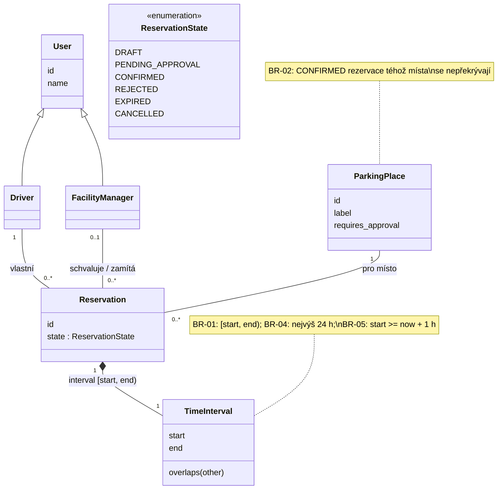

# Architecture and decisions

## Overview

```
tests/            → exercise domain rules and persistence
src/parking/
  domain.py       → ParkingPlace, User, Reservation, State + business rules
  repository.py   → SQLite persistence of reservations
```

The domain module has no I/O. The repository stores and loads reservations;
rule checks that need existing data (overlap) take the loaded reservations
as input. The Notification Service boundary will be a small interface in
the domain with a stub implementation (not in C01).

## Decisions

### D1 – Python, standard library only
Chosen over Java + Spring Boot because the whole team knows Python, nothing
has to be installed, and a clean checkout runs with one command. Cost: no
framework for the later HTTP layer; we will add one (FastAPI or Flask) when
the walking skeleton needs it.

### D2 – SQLite as the database
Zero configuration, file-based, ships with Python. Sufficient for CP1 and
for the expected load of a single car park. Revisit if the *Unknown* in the
Project Frame turns out badly.

### D3 – Times stored as UTC ISO-8601 strings
SQLite has no datetime type. The C01 spike (`docs/evidence-and-evolution.md`)
showed that `isoformat()` / `fromisoformat()` round-trips timezone-aware
datetimes losslessly, so no custom adapters are used.

---

# C03 — Architektura

Navazuje na Specification Baseline v0.2 (`docs/specification.md`) a na
drivery AD-01 a AD-02 z C02.

**Zvolený scénář:** OP-03 Confirm na místě se schválením (`VIP-01`)
→ `PENDING_APPROVAL` → později OP-05 Approve / Reject / Expire.
**Komplikace:** souběh. Dvě překrývající se žádosti téhož místa schvaluje
manažer ve dvou instancích aplikace současně (REQ-04, REQ-06).

## Část A — AS-IS (mapování současné implementace)

Stav kódu na commitu `bb72a77` (konec C02).

| Prvek (soubor) | Co dnes dělá | Jaký stav drží | Na čem závisí |
|---|---|---|---|
| `gui.py` `App` | formulář a tabulka, **skládá use-casy**: vybere místo, dodá `now`, zavolá doménovou funkci uvnitř `repo.apply(...)`, spouští vypršení | pevný seznam míst `PLACES` | `domain`, `repository` |
| `domain.py` | pravidla BR-01..BR-05, přechody `confirm`, `approve`, `reject`, `cancel`, `expire_if_due` | — (čisté funkce, bez I/O) | nic |
| `repository.py` `ReservationRepository` | SQLite, `save`/`get`/`for_place`, `apply(id, operation)` provede předanou operaci pod `BEGIN IMMEDIATE` | tabulka `reservation` | `domain` |
| `run.py` | spustí GUI nad souborem `parking.db` | — | `gui` |

Průchod scénářem v kódu (Approve):
`App.approve` ([gui.py:135](../src/parking/gui.py#L135)) → `repo.apply(rid, lambda r, existing: approve(r, existing, now))`
→ `BEGIN IMMEDIATE` → `get` + `for_place` → `domain.approve` (kontrola BR-02,
`state = CONFIRMED`) → `save` → `COMMIT`.

**Nálezy:**

- **F1 — Use-case řídí GUI.** Které pravidlo se zavolá, s jakým místem a
  jakým `now`, rozhoduje `App` ([gui.py:129-151](../src/parking/gui.py#L129-L151)).
  Aplikační vrstva neexistuje.
- **F2 — Atomičnost drží repozitář, ale jen když ho klient použije správně.**
  `repo.apply` ([repository.py:38](../src/parking/repository.py#L38)) přijme libovolný
  callback. `App.create` a `App.check` volají `save` / `for_place` mimo něj.
  Kdo zavolá `domain.confirm` mimo `apply`, poruší REQ-04, a nic ho nezastaví.
- **F3 — Katalog míst je v GUI.** `PLACES` včetně `requires_approval`
  ([gui.py:12](../src/parking/gui.py#L12)). Jiný klient by ho musel zkopírovat.
- **F4 — Vypršení spouští jen obnovení tabulky.** `refresh()`
  ([gui.py:93-100](../src/parking/gui.py#L93-L100)). Když nikdo GUI neobnoví,
  `PENDING_APPROVAL` po `start` visí (REQ-08).
- **F5 — Notification Service chybí.** Je jen v Project Frame (C01). V kódu
  není rozhraní ani volání.
- **F6 — Role se nerozlišují.** Approve může stisknout kdokoli. Doména ani
  GUI nezná Facility managera.

## B. Architektonické drivery

| ID | Podklad / zdroj | Proč ovlivňuje architekturu | Otázka, kterou musí architektura vyřešit |
|---|---|---|---|
| AD-01 | BR-02, REQ-04, REQ-06, Část A F2 | dva souběžné požadavky (Confirm/Approve) mohou oba vidět „bez kolize“; dnes BR-02 platí jen proto, že GUI volá `repo.apply` | kde se dělá autoritativní rozhodnutí o potvrzení a kde leží hranice transakce, aby BR-02 platilo pro každého klienta? |
| AD-02 | REQ-06..REQ-08, OP-05, Část A F4 | rozhodnutí manažera přichází později, stav musí přežít konec požadavku i zavření aplikace; vypršení závisí jen na čase | kdo vlastní stav `PENDING_APPROVAL` a kdo provádí pozdější přechod (approve / reject / expire)? |
| AD-03 | Project Frame „External boundary“ (C01), Část A F5 | změna stavu je uložená dřív, než se odešle notifikace; Notification Service může selhat | má selhání notifikace změnit výsledek Confirm/Approve a kdo řeší opakování? |
| AD-04 | README CP1 (`POST /reservations`), Část A F1, F3 | přibude druhý klient (HTTP); logika složená v GUI by se musela zkopírovat a mohla by se rozejít | kde musí žít řízení use-casů a katalog míst, aby se všichni klienti chovali stejně? |

AD-01 a AD-02 jsou z C02. AD-03 vychází z hranice systému z C01, AD-04
z nálezů Části A a z plánu CP1. Role (F6) jako driver nebereme. Patří k
přihlašování, které CP1 zatím nevyžaduje (viz zbývající rizika).

## C1. Doménový třídní model

Pojmy pro scénář Confirm → Approve. `TimeInterval` je v kódu zatím jen
dvojice `start`/`end` v `Reservation`. Jako pojem ho uvádíme kvůli BR-01.



Oproti C02 je nové jen to, že role Driver a Facility manager jsou
pojmenované. Facility manager rozhoduje o žádosti (OP-05). V kódu role zatím
nejsou (Část A F6).

## C2. Odpovědnosti systému

| # | Zdroj | Odpovědnost | Co musí rozhodovat / vlastnit | Jeden vlastník? | Důvod | Seskupit s | Oddělit od |
|---|---|---|---|---|---|---|---|
| R1 | Confirm, Approve, Cancel + statechart v0.2 | rozhodnout, zda je přechod lifecycle povolen | přechody stavů `Reservation` | ano | různé části nesmí rozhodnout odlišně | R2, R3 (stejný stav) | UI, SQLite (jiný důvod změny) |
| R2 | BR-02, REQ-04, REQ-06 | vyhodnotit kolizi a zachovat BR-02 i při souběhu: čtení, kontrola a zápis jako jeden nedělitelný krok | rozhodnutí o potvrzení při kolizi, hranice transakce | ano | kdyby atomičnost zajišťoval každý klient sám, jeden ji vynechá (F2) | R1 | UI (klient ji nesmí obejít) |
| R3 | OP-05, AD-02 | spravovat čekající žádost o schválení | stav `PENDING_APPROVAL` a jeho uzavření approve / reject / expire | ano | stav přežívá požadavek i zavření aplikace | R1 (je to stav lifecycle) | spouštěč vypršení (R4) |
| R4 | REQ-08, AD-02 | spustit kontrolu vypršení v čase | **kdy** se kontrola spustí, ne **zda** žádost vyprší | ne (spouštěčů může být víc, rozhodnutí je R1/R3) | plynutí času nemá aktéra | — | R1/R3 (jiný důvod změny: provoz a plánování) |
| R5 | Část A F3, REQ-03 v0.2 | poskytnout katalog míst včetně `requires_approval` | seznam míst a jejich vlastnosti | ano | Confirm se podle místa větví; dva katalogy = dvě chování | — | UI (dnes je katalog v GUI) |
| R6 | C01 spike, D2 | uložit rezervace a načíst je pro kontrolu kolize | uložený stav, zámek pro zápis | ano | jediný zdroj pravdy pro všechny instance | — | pravidla R1/R2 (jiná technologie; SQLite se může vyměnit, Unknown z C01) |
| R7 | AD-03, Project Frame C01 | oznámit Driverovi výsledek (potvrzeno, zrušeno, zamítnuto, vypršelo) | doručení a případné opakování | podle návrhu | externí služba může selhat a její výpadek musí mít jasný význam | — | R1/R2 (jiná failure boundary a externí technologie; nesmí být uvnitř transakce) |
| R8 | AD-04, README CP1 | přijmout požadavek uživatele a zobrazit výsledek | nic nerozhoduje, přechod jen vyžaduje | ne | přibude HTTP klient vedle GUI | — | R1–R7 (jiný důvod změny: prezentace a protokol) |
