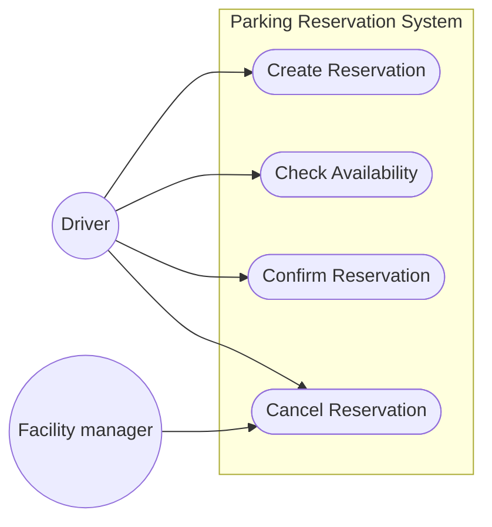
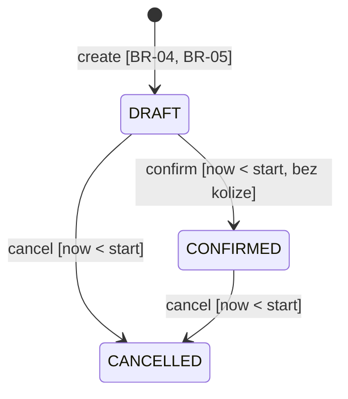
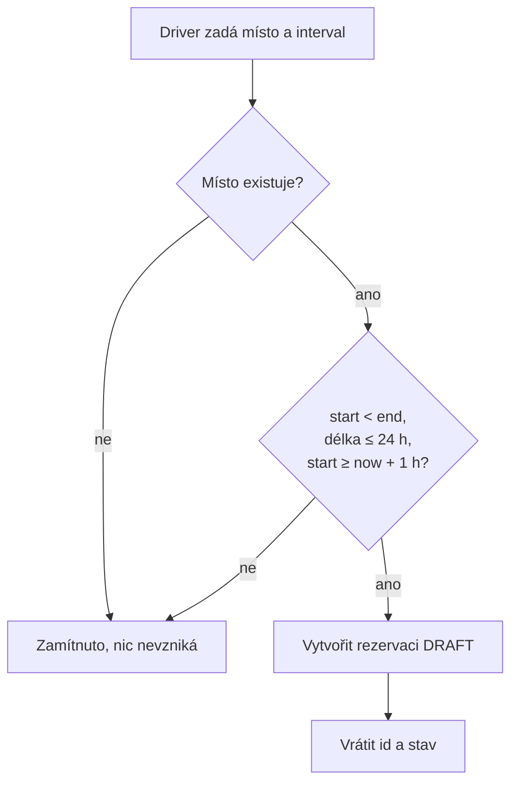
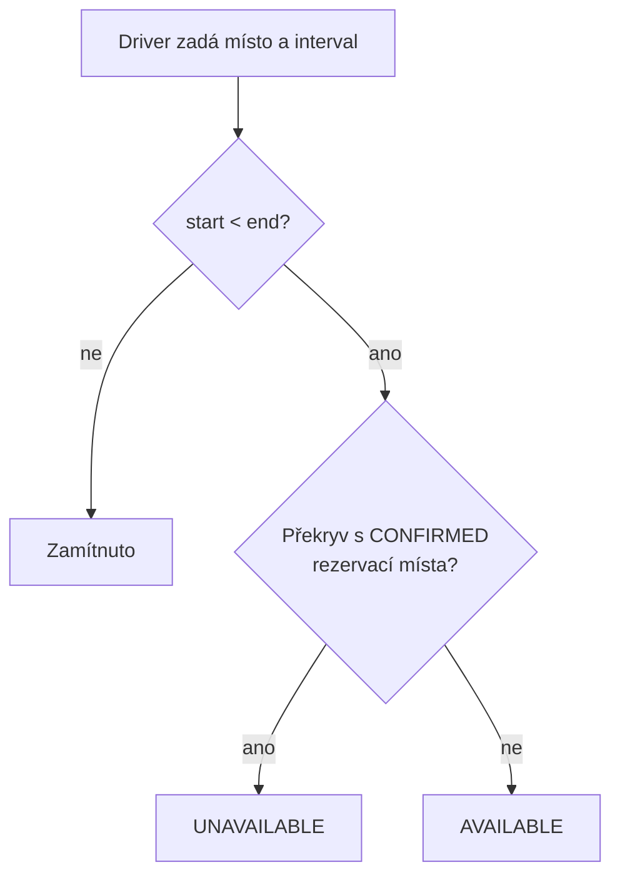
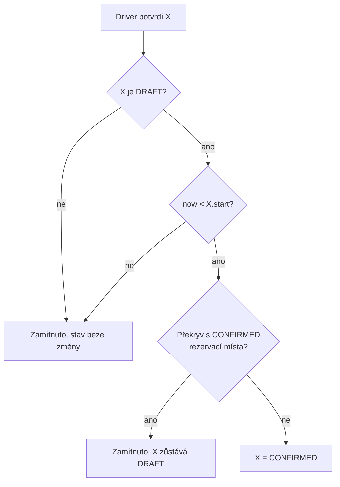
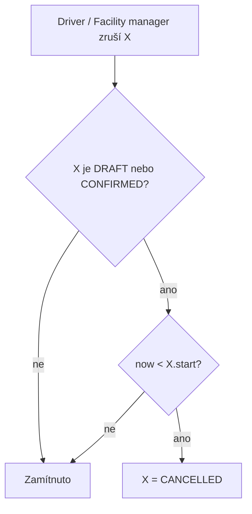
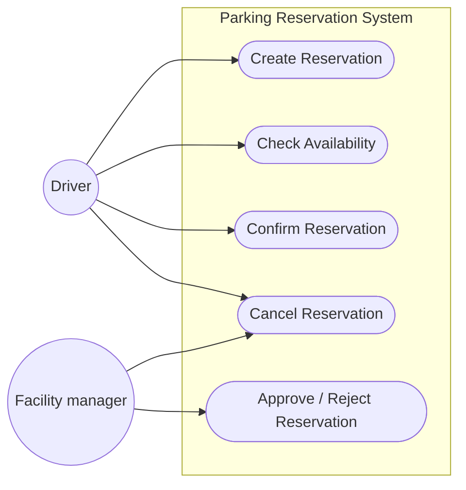
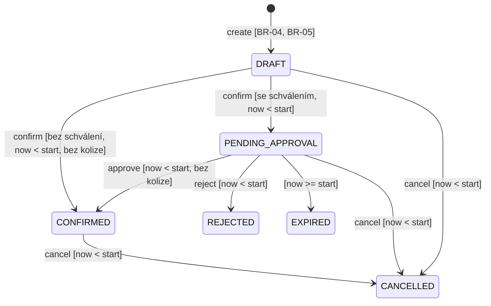
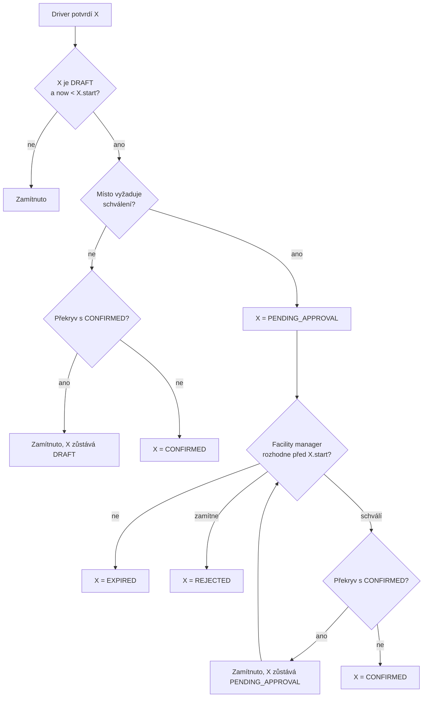

# Specifikace chování — rezervace parkovacích míst

Navazuje na Project Frame z C01 (`docs/intent-and-change.md`).

- **Resource** = ParkingPlace, exkluzivní: na místě stojí nejvýš jedno auto.
- **Driver** vytváří, potvrzuje a ruší své rezervace.
- **Facility manager** spravuje místa a může zrušit libovolnou rezervaci (C01).
- **`now`** = čas serveru v UTC. Všechny časové podmínky se vyhodnocují vůči němu.

Část A je baseline v0.1 (čtyři základní operace). Část B popisuje změnu
„schvalovací proces“ a výslednou baseline v0.2.

---

## A. Baseline v0.1

### Doménová pravidla

**BR-01 — Interval.** Rezervace zabírá interval `[start, end)`. Dva intervaly
se překrývají, právě když `a.start < b.end` a `b.start < a.end`. Rezervace,
které na sebe jen navazují (`a.end == b.start`), se nepřekrývají.

**BR-02 — Exkluzivní místo.** Dvě `CONFIRMED` rezervace téhož místa se nikdy
nepřekrývají. Místo blokuje jen `CONFIRMED` rezervace, žádný jiný stav.

**BR-03 — Rušení.** Zrušit lze rezervaci ve stavu `DRAFT` nebo `CONFIRMED`,
a to jen když `now < start`. Zrušená rezervace se nemaže, zůstává uložená ve
stavu `CANCELLED`. Druhé zrušení je chyba, ne tichý no-op.

**BR-04 — Nejvýš 24 hodin** (doménové pravidlo z C01). `end - start <= 24 h`.
Místa jsou na parkování, ne na odstavení auta na několik dní.

**BR-05 — Předstih aspoň 1 hodina.** Při vytvoření musí platit
`start >= now + 1 h`. Rezervace zpětně nedává smysl a hodinu tým považuje za
rozumný čas na potvrzení. Hodnota 1 h je rozhodnutí týmu, ne převzatý údaj.

**Časová hranice `start`.** Potvrdit i zrušit rezervaci lze jen před jejím
začátkem (`now < start`). `DRAFT`, u kterého `start` uplynul, už nejde
potvrdit ani zrušit. Zůstane ve stavu `DRAFT` a nic neblokuje (BR-02).

---

### OP-01 — Create Reservation

**Cíl:** Driver zaznamená, že chce konkrétní místo na konkrétní dobu. Místo
tím ještě nezabírá.

**Spouštěcí událost:** Driver zadá místo `P` a interval `[start, end)`.

**Požadavek:**
> **REQ-01:** Pro existující místo a platný interval systém vytvoří novou
> rezervaci ve stavu `DRAFT`. Interval je platný, když `start < end`
> (BR-01), `end - start <= 24 h` (BR-04) a `start >= now + 1 h` (BR-05).

**Předpoklady:** Driver je přihlášený; místo `P` existuje.

**Po úspěchu:** existuje jedna nová rezervace ve stavu `DRAFT`. Dostupnost
místa se nemění.

**Změna stavu:** `[*] → DRAFT`

**Pravidla:** BR-01, BR-04, BR-05.

**Hlavní scénář:**
1. Driver zadá místo a interval.
2. Systém ověří místo a interval.
3. Systém vytvoří rezervaci `DRAFT` a vrátí její id a stav.

**Chybové výsledky:** v každém případě se rezervace nevytvoří.
- neznámé místo;
- `end <= start`;
- delší než 24 h;
- `start < now + 1 h`, včetně `start` v minulosti.

**Příklady ověření** (`now` = 06:00):

| Vstup | Výsledek |
|---|---|
| 08:00–10:00 | `DRAFT` |
| 08:00–08:00 | zamítnuto |
| 08:00 – 08:00 další den (24 h) | `DRAFT` (hranice) |
| 08:00 – 09:00 další den (25 h) | zamítnuto |
| 07:00–08:00 (`start` přesně `now + 1 h`) | `DRAFT` (hranice) |
| 06:30–08:00 | zamítnuto |
| 05:00–07:00 (`start` v minulosti) | zamítnuto |

**Zdůvodnění:** Kolize se při Create nekontroluje. `DRAFT` místo neblokuje,
takže dva Drivery mohou mít `DRAFT` na stejný čas. Rozhodne až Confirm.

**TBD:** Přihlášení a seznam míst zatím řeší GUI (pevný seznam míst).
Kam to patří, rozhodne architektura v C03.

---

### OP-02 — Check Availability

**Cíl:** Driver zjistí, jestli je místo v daném čase volné, dřív než
rezervaci vytvoří nebo potvrdí.

**Spouštěcí událost:** Driver se zeptá na místo `P` a interval `[start, end)`.

**Požadavek:**
> **REQ-02:** Pro interval se `start < end` systém odpoví `UNAVAILABLE`,
> pokud se interval překrývá s nějakou `CONFIRMED` rezervací místa `P`,
> jinak `AVAILABLE`.

**Předpoklady:** místo existuje.

**Po úspěchu:** systém vrátí odpověď. Žádná rezervace se nemění.

**Změna stavu:** žádná.

**Pravidla:** BR-01, BR-02.

**Hlavní scénář:**
1. Driver zadá místo a interval.
2. Systém ověří, že `start < end`.
3. Systém porovná interval s `CONFIRMED` rezervacemi místa a vrátí odpověď.

**Chybové výsledky:** `end <= start` → zamítnuto, žádná odpověď.

**Příklady ověření** (místo má `CONFIRMED` rezervaci 10:00–11:00):

| Dotaz | Výsledek |
|---|---|
| 09:00–10:00 | `AVAILABLE` (navazuje zleva) |
| 10:30–11:30 | `UNAVAILABLE` |
| 11:00–12:00 | `AVAILABLE` (navazuje zprava) |
| 11:00–11:00 | zamítnuto |

**Zdůvodnění:** Odpověď platí jen v okamžiku dotazu a nic nerezervuje. Mezi
dotazem a potvrzením může místo obsadit někdo jiný. Rozhoduje až kontrola
v Confirm.

---

### OP-03 — Confirm Reservation

**Cíl:** Z `DRAFT` se stane platná rezervace, která místo skutečně zabírá.

**Spouštěcí událost:** Driver potvrdí svou rezervaci `X`.

**Požadavky:**
> **REQ-03:** Systém převede `X` z `DRAFT` na `CONFIRMED`, jen pokud
> `now < X.start` a `X` se nepřekrývá s žádnou `CONFIRMED` rezervací téhož
> místa.
>
> **REQ-04:** Když se souběžně potvrzují dvě překrývající se rezervace téhož
> místa, skončí `CONFIRMED` nejvýš jedna z nich.

**Předpoklady:** `X` existuje a je ve stavu `DRAFT`.

**Po úspěchu:** `X` je `CONFIRMED` a blokuje místo na svůj interval. BR-02
stále platí.

**Změna stavu:** `DRAFT → CONFIRMED`

**Pravidla:** BR-01, BR-02, časová hranice `start`.

**Hlavní scénář:**
1. Driver zvolí rezervaci `X` a potvrdí ji.
2. Systém ověří, že `X` je `DRAFT` a `now < X.start`.
3. Systém ověří, že `X` nekoliduje s žádnou `CONFIRMED` rezervací místa.
4. Systém nastaví `X` na `CONFIRMED`.

**Chybové výsledky:** v každém případě zůstává stav `X` beze změny.
- `X` není `DRAFT`;
- `now >= X.start`;
- kolize s `CONFIRMED` rezervací.

**Příklady ověření:**

| Vstup | Výsledek |
|---|---|
| `DRAFT` 08:00–10:00, místo volné | `CONFIRMED` |
| `DRAFT` 09:00–11:00, existuje `CONFIRMED` 08:00–10:00 | zamítnuto, zůstává `DRAFT` |
| `DRAFT` 10:00–11:00, existuje `CONFIRMED` 08:00–10:00 | `CONFIRMED` (navazuje) |
| rezervace, která už je `CONFIRMED` | zamítnuto |
| `DRAFT` 08:00–09:00, `now` = 08:00 | zamítnuto, zůstává `DRAFT` (hranice) |
| dvě souběžná potvrzení překrývajících se `DRAFT` | nejvýš jedna `CONFIRMED` |

**Zdůvodnění:** Confirm je jediný okamžik, kdy vzniká alokace. Proto se
kolize kontroluje tady, a ne při Create.

**Jak se REQ-04 ověřuje:** dvě instance aplikace nad stejným souborem
`parking.db` potvrzují dvě překrývající se `DRAFT` rezervace současně.
Pozorovatelný výsledek: v úložišti je `CONFIRMED` nejvýš jedna a druhý pokus
skončí chybou. Test `tests/test_concurrency.py` pouští obě potvrzení ve dvou
vláknech se dvěma spojeními a mezi kontrolou a zápisem čeká 0,2 s. Bez
atomického zápisu test prokazatelně selže.

---

### OP-04 — Cancel Reservation

**Cíl:** Driver stáhne rezervaci, kterou už nepotřebuje, a uvolní místo
ostatním. Facility manager může stejným způsobem zrušit libovolnou rezervaci.

**Spouštěcí událost:** Driver (nebo Facility manager) zruší rezervaci `X`.

**Požadavek:**
> **REQ-05:** Systém převede `X` do stavu `CANCELLED`, pokud je `X` ve stavu
> `DRAFT` nebo `CONFIRMED` a `now < X.start` (BR-03).

**Předpoklady:** `X` existuje.

**Po úspěchu:** `X` je `CANCELLED` a nic neblokuje.

**Změna stavu:** `DRAFT → CANCELLED`, `CONFIRMED → CANCELLED`

**Pravidla:** BR-03.

**Hlavní scénář:**
1. Uživatel zvolí rezervaci `X` a zruší ji.
2. Systém ověří stav `X` a `now < X.start`.
3. Systém nastaví `X` na `CANCELLED`.

**Chybové výsledky:** v každém případě zůstává stav `X` beze změny.
- `X` je už `CANCELLED` → chyba (opakované zrušení);
- `now >= X.start` → chyba.

**Souběh Cancel × Confirm téže `DRAFT` rezervace:** výsledek je vždy
`CANCELLED`.
- Když proběhne dřív Cancel, Confirm selže, protože `X` už není `DRAFT`.
- Když proběhne dřív Confirm, Cancel pak zruší `CONFIRMED` rezervaci.

Rezervace, kterou uživatel úspěšně zrušil, nesmí zůstat `CONFIRMED`.
Ověřuje to `tests/test_concurrency.py` stejně jako REQ-04.

**Příklady ověření** (`X` = 08:00–09:00):

| Vstup | Výsledek |
|---|---|
| `DRAFT`, `now` = 07:00 | `CANCELLED` |
| `CONFIRMED`, `now` = 07:00 | `CANCELLED`, místo je znovu `AVAILABLE` |
| `CONFIRMED`, `now` = 08:00 | zamítnuto, zůstává `CONFIRMED` (hranice) |
| `CANCELLED`, zrušeno podruhé | zamítnuto |

**Zdůvodnění:** Hranici `start` jde jednoznačně ověřit a nepotřebuje žádnou
další hodnotu, například storno lhůtu. Po začátku už místo mohlo být
využité. Opakované zrušení vracíme jako chybu, protože znamená, že uživatel
pracuje se zastaralým stavem.

---

### Kontrola přijetí požadavků

Pojmy a hranice (`[start, end)`, `now` v UTC, blokující stav `CONFIRMED`) jsou
definované jednou v doménových pravidlech výše. Požadavky popisují stav a
odpověď systému, ne technologii. Každý požadavek má automatický test
(viz `docs/evidence-and-evolution.md`).

| Požadavek | Proč existuje | Stav / čas / hranice | Souběh | Co by ukázalo porušení |
|---|---|---|---|---|
| REQ-01 Create | zachytit záměr bez obsazení místa | `start >= now + 1 h`, délka ≤ 24 h (obě hranice přijaty) | nevadí, `DRAFT` nic neblokuje | vznikne rezervace na 25 h nebo se `start` v minulosti |
| REQ-02 Availability | rozhodnout se před potvrzením | `[start, end)`; blokuje jen `CONFIRMED` | odpověď může zastarat, rozhoduje Confirm | navazující rezervace hlášena jako `UNAVAILABLE` |
| REQ-03 Confirm | jediný okamžik vzniku alokace | jen `DRAFT`, jen `now < start` | viz REQ-04 | dvě překrývající se `CONFIRMED`; potvrzení po `start` |
| REQ-04 Confirm souběh | BR-02 musí platit i při souběhu | platí pro souběžné pokusy před `start`; kontrola a zápis musí být jeden nedělitelný krok | přímo o souběhu | dvě `CONFIRMED` po souběžném potvrzení (test se dvěma spojeními nad jedním souborem) |
| REQ-05 Cancel | uvolnit místo, které nebude využito | jen `now < start`; opakování je chyba | Cancel × Confirm → vždy `CANCELLED` | zrušení po `start`; zrušená rezervace dál blokuje |

Otevřená zůstává jen jedna věc a je označená jako TBD: přihlášení a seznam
míst (OP-01).

---

### Diagram případů užití — v0.1

Notification Service z C01 tu jako aktér není. Nemá vlastní cíl, je to jen
závislost systému.

### Stavový diagram Reservation — v0.1

`CANCELLED` je koncový stav. `DRAFT` po uplynutí `start` nemá žádný povolený
přechod.

### Diagramy aktivit — v0.1

**Create Reservation**

**Check Availability**

**Confirm Reservation**

**Cancel Reservation**

### Kontrola konzistence — v0.1

| Co se porovnává | Výsledek |
|---|---|
| Create vs. Confirm | Create místo neobsazuje, alokace vzniká jen v Confirm. Kolize se proto kontroluje jen v Confirm. |
| Availability vs. Confirm | Obě operace berou jako blokující jen `CONFIRMED` a obě používají stejný překryv (BR-01). |
| Cancel vs. stavový diagram | REQ-05 povoluje zrušit `DRAFT` i `CONFIRMED` do `start`. Diagram má právě tyto dva přechody se stejnou podmínkou. |
| Časové hranice | Confirm i Cancel končí na stejné hranici `now < start`. Neexistuje okno, kdy by šla jedna operace a druhá ne. |
| Intervaly | Text, příklady i testy používají `[start, end)`. Navazující rezervace jsou vždy povolené. |
| Aktéři vs. text | Každá šipka v diagramu případů užití má svou operaci. Facility manager odpovídá C01 (smí rušit). |
| Požadavky vs. návrh | Žádný požadavek nepředepisuje technologii. SQLite je rozhodnutí D2, ne požadavek. |
| Vymyšlená přesnost | Jediná zavedená čísla jsou 24 h (z C01) a 1 h (BR-05, rozhodnutí týmu i s důvodem). |

**Stav: Specification Baseline v0.1 — schválená týmem** (ParkingCrew:
RomanGregor, Ondra-lab, Kirisok).

---

## B. Změna — schvalovací proces

> Některá místa vyžadují schválení oprávněnou osobou, než se rezervace může
> stát `CONFIRMED`. Schválení může být opožděno, zamítnuto nebo může vypršet.

U nás jde o místa s příznakem `requires_approval` (v aplikaci místo
`VIP-01`). Schvaluje je Facility manager.

### Změnová karta — analýza dopadu

Sepsáno před úpravou specifikace.

| Oblast | Otázka | Rozhodnutí |
|---|---|---|
| Create | Mění se? | Ne. Vždy vzniká `DRAFT`, bez ohledu na místo. |
| Availability | Blokuje `PENDING_APPROVAL`? | Ne. Neschválená žádost ještě není alokace. Kdyby blokovala, zamítnutá nebo propadlá žádost by místo zbytečně držela. |
| Confirm | Okamžitý, nebo žádost + schválení? | Na místě se schválením Confirm jen podá žádost: `DRAFT → PENDING_APPROVAL`, bez kontroly kolize. Na ostatních místech se nic nemění. |
| Approve | Nová operace? Kdo? | Ano, OP-05 Approve Reservation (schválit / zamítnout). Provádí ji Facility manager. |
| Cancel | Lze zrušit `PENDING_APPROVAL`? | Ano, za stejné podmínky `now < start`. |
| Stavy | Co přibude? | `PENDING_APPROVAL`, `REJECTED`, `EXPIRED`. |
| Případy užití | Nový aktér / cíl? | Aktér ne, Facility manager už existuje. Přibude mu cíl Approve / Reject. |
| Ověření | Jak ověřit zpoždění, zamítnutí, vypršení? | Zpoždění: žádost zůstává `PENDING_APPROVAL` a místo je dál `AVAILABLE`. Zamítnutí: `REJECTED`. Vypršení: po `start` bez rozhodnutí je `EXPIRED`. |
| Architektura | Nový driver? | Ano. Vypršení závisí na plynutí času a rozhodnutí přichází s odstupem (AD-02). |

### Dopad změny C02

- **Změněná podmínka:** místo může mít `requires_approval = true`.
- **Dotčené požadavky:** REQ-03 (Confirm se větví podle místa), REQ-05 a
  BR-03 (zrušitelný je i `PENDING_APPROVAL`).
- **Nedotčené a proč:**
  - REQ-01 Create: nezávisí na schvalování.
  - REQ-02 Availability: blokuje dál jen `CONFIRMED`, nový stav neblokuje.
  - REQ-04: platí beze změny, jen se nově týká i Approve (REQ-06).
  - BR-01, BR-02, BR-04, BR-05: beze změny. BR-02 se nově vynucuje i při Approve.
- **Nový aktér / operace:** nový aktér není. Nová operace je OP-05 Approve
  Reservation pro Facility managera.
- **Změněná pravidla / stavy:** BR-03 zahrnuje `PENDING_APPROVAL`. Nové
  stavy jsou `PENDING_APPROVAL` (čeká na rozhodnutí, neblokuje), `REJECTED`
  (zamítnuto, koncový) a `EXPIRED` (nerozhodnuto do `start`, koncový).
- **Změna diagramu případů užití:** Facility manager má nový cíl Approve /
  Reject Reservation.
- **Změna stavového diagramu:** přibyly tři stavy a přechody
  `DRAFT → PENDING_APPROVAL` a
  `PENDING_APPROVAL → CONFIRMED | REJECTED | EXPIRED | CANCELLED`.
- **Nové příklady ověření:** tabulky u OP-03, OP-04 a OP-05 níže.
- **Architektonické drivery pro C03:** AD-01 (rozšířený o Approve), AD-02.

### OP-03 — Confirm Reservation (revize v0.2)

> **REQ-03 (v0.2):** Pro `X` ve stavu `DRAFT` a `now < X.start`:
> - na místě **bez** schválení platí REQ-03 z v0.1 (`CONFIRMED`, pokud
>   nekoliduje);
> - na místě **se** schválením systém převede `X` na `PENDING_APPROVAL`.
>   Kolize se tu nekontroluje. Kontroluje se až při schválení (REQ-06),
>   protože teprve tam vzniká alokace.

Ostatní části OP-03 se nemění.

| Vstup | Výsledek |
|---|---|
| `DRAFT` na běžném místě, volno | `CONFIRMED` (beze změny) |
| `DRAFT` na místě se schválením, i když existuje kolidující `CONFIRMED` | `PENDING_APPROVAL` |
| `DRAFT` na místě se schválením, `now >= start` | zamítnuto, zůstává `DRAFT` |

### OP-04 — Cancel Reservation (revize v0.2)

> **REQ-05 (v0.2):** Systém převede `X` do `CANCELLED`, pokud je `X` ve stavu
> `DRAFT`, `PENDING_APPROVAL` nebo `CONFIRMED` a `now < X.start`.

**BR-03 (v0.2):** Zrušit lze `DRAFT`, `PENDING_APPROVAL` nebo `CONFIRMED`,
jen když `now < start`. Druhé zrušení je chyba.

Souběh Cancel × Approve dopadá stejně jako Cancel × Confirm: výsledek je vždy
`CANCELLED`.

| Vstup | Výsledek |
|---|---|
| `PENDING_APPROVAL`, `now < start` | `CANCELLED` |
| `REJECTED` nebo `EXPIRED` | zamítnuto |

### OP-05 — Approve Reservation (nová)

**Cíl:** Facility manager rozhodne o žádosti na místo se schválením.
Schválená žádost místo zabere, zamítnutá ne.

**Spouštěcí událost:** Facility manager schválí nebo zamítne rezervaci `X`.

**Požadavky:**
> **REQ-06:** Systém převede `X` z `PENDING_APPROVAL` na `CONFIRMED`, jen
> pokud `now < X.start` a `X` se v tu chvíli nepřekrývá s žádnou `CONFIRMED`
> rezervací téhož místa. Pro souběžná schválení platí REQ-04.
>
> **REQ-07:** Systém převede `X` z `PENDING_APPROVAL` na `REJECTED`, pokud
> ji Facility manager zamítne a `now < X.start`. `REJECTED` je koncový stav.
>
> **REQ-08:** `PENDING_APPROVAL` rezervace, o které nikdo nerozhodl do
> `X.start`, přejde do `EXPIRED`. `EXPIRED` je koncový stav a nic neblokuje.

**Předpoklady:** `X` existuje a je ve stavu `PENDING_APPROVAL`. Operaci
provádí Facility manager.

**Po úspěchu (schválení):** `X` je `CONFIRMED` a blokuje místo. BR-02 stále
platí.

**Změna stavu:** `PENDING_APPROVAL → CONFIRMED | REJECTED | EXPIRED`

**Pravidla:** BR-01, BR-02, časová hranice `start`.

**Hlavní scénář (schválení):**
1. Facility manager zvolí `X` a schválí ji.
2. Systém ověří, že `X` je `PENDING_APPROVAL` a `now < X.start`.
3. Systém znovu zkontroluje kolizi s `CONFIRMED` rezervacemi místa.
4. Systém nastaví `X` na `CONFIRMED`.

**Alternativní a chybové výsledky:**
- kolize při schválení → zamítnuto, `X` zůstává `PENDING_APPROVAL`
  (manažer ji může zamítnout, jinak vyprší);
- manažer žádost zamítne → `REJECTED`;
- `now >= X.start` → schválení i zamítnutí selže a `X` vyprší (`EXPIRED`);
- `X` není `PENDING_APPROVAL` → zamítnuto, stav beze změny. Platí i pro
  `DRAFT`: ten ještě nebyl odeslán ke schválení a stahuje se přes Cancel.

**Souběh Approve × Reject:** platí rozhodnutí, které proběhne dřív. Druhé
selže, protože `X` už není `PENDING_APPROVAL`.

**Příklady ověření** (`X` = 08:00–09:00):

| Vstup | Výsledek |
|---|---|
| `PENDING_APPROVAL`, `now` = 07:00, volno | schválení → `CONFIRMED` |
| `PENDING_APPROVAL`, mezitím vznikla `CONFIRMED` 08:30–10:00 | schválení zamítnuto, zůstává `PENDING_APPROVAL` |
| `PENDING_APPROVAL`, `now` = 07:00 | zamítnutí → `REJECTED` |
| `PENDING_APPROVAL`, `now` = 08:00 | schválení i zamítnutí selže; vypršení → `EXPIRED` |
| `PENDING_APPROVAL`, `now` = 07:00 | vypršení nenastane, zůstává `PENDING_APPROVAL` |
| `DRAFT` | schválení i zamítnutí selže |

**Zdůvodnění:** Kolize se kontroluje až při schválení, protože mezi podáním
žádosti a rozhodnutím mohl místo obsadit někdo jiný. Lhůta pro rozhodnutí
končí na `start`, stejně jako u Confirm a Cancel. Nepotřebujeme tak žádnou
novou hodnotu bez zdroje.

**TBD:** Zadání neurčuje, jestli má mít Facility manager kratší lhůtu než do
`start` (například aby se Driver dozvěděl výsledek včas). Necháváme to
otevřené.

### Kontrola přijetí nových požadavků

| Požadavek | Proč existuje | Stav / čas / hranice | Souběh | Co by ukázalo porušení |
|---|---|---|---|---|
| REQ-03 (v0.2) | žádost na místo se schválením nesmí rovnou obsadit místo | jen `DRAFT`, jen `now < start` | kolize se řeší až v REQ-06 | `DRAFT` na místě se schválením skončí rovnou `CONFIRMED` |
| REQ-05 (v0.2) | Driver musí jít stáhnout i čekající žádost | jen `now < start` | Cancel × Approve → vždy `CANCELLED` | `PENDING_APPROVAL` nejde zrušit |
| REQ-06 Approve | vznik alokace na místě se schválením | jen `now < start` | REQ-04 | dvě překrývající se `CONFIRMED` po schválení |
| REQ-07 Reject | manažer musí jít žádost odmítnout | jen `now < start` | Approve × Reject → platí první | `REJECTED` rezervace se později stane `CONFIRMED` |
| REQ-08 Expire | nerozhodnutá žádost nesmí viset navždy | `now >= start` | disjunktní s Approve/Reject díky hranici `start` | `PENDING_APPROVAL` po `start` jde schválit |

### Diagram případů užití — v0.2

Vypršení nemá aktéra. Způsobuje ho plynutí času, ne něčí cíl.

### Stavový diagram Reservation — v0.2

Koncové stavy jsou `CANCELLED`, `REJECTED` a `EXPIRED`.

### Diagram aktivit — Confirm a Approve (v0.2)

Nahrazuje diagram Confirm z v0.1. Ostatní diagramy aktivit platí beze změny,
jen u Cancel je nově povolený i stav `PENDING_APPROVAL`.

### Kontrola konzistence — v0.2

| Co se porovnává | Výsledek |
|---|---|
| REQ-03 vs. stavový diagram | Dvě větve REQ-03 odpovídají přechodům `DRAFT → CONFIRMED` a `DRAFT → PENDING_APPROVAL` se stejnými podmínkami. |
| REQ-05 / BR-03 vs. diagram | Zrušitelné jsou právě `DRAFT`, `PENDING_APPROVAL` a `CONFIRMED`. Koncové stavy zrušit nejde. |
| Availability vs. nové stavy | Blokuje dál jen `CONFIRMED`. `PENDING_APPROVAL`, `REJECTED` ani `EXPIRED` neblokují. |
| Approve vs. Expire | Schválení i zamítnutí vyžadují `now < start`, vypršení nastává při `now >= start`. Nemůže nastat obojí a žádost nemůže zůstat viset. |
| REQ-06 vs. BR-02 | Approve dělá stejnou kontrolu kolize jako Confirm, takže BR-02 platí i s odloženým schválením. |
| Případy užití vs. text | Nový cíl Approve / Reject má operaci OP-05. Vypršení je přechod bez aktéra. |

**Stav: Specification Baseline v0.2 — schválená týmem.**

---

## Architektonické drivery pro C03

- **AD-01 — Atomické potvrzení a schválení.** REQ-04 a REQ-06 vyžadují, aby
  ze souběžných konfliktních pokusů skončila `CONFIRMED` nejvýš jedna
  rezervace. Stejně je to u Cancel × Confirm. Aplikace to teď plní
  nejjednodušším způsobem: každá změna stavu proběhne pod zámkem SQLite
  pro zápis (`BEGIN IMMEDIATE`) a zamkne se celá databáze. Pro C03 zůstává
  otevřené, kde má hranice transakce v architektuře ležet (teď ji drží
  repozitář a pravidlo mu předává GUI) a jestli zámek celé databáze vydrží
  víc klientů nebo přechod na serverovou databázi (Unknown z C01).
- **AD-02 — Schvalování a vypršení v čase.** Rozhodnutí manažera přichází
  s odstupem a vypršení závisí jen na čase. Aplikace teď vypršení kontroluje
  jen při obnovení GUI. Když aplikace neběží, `PENDING_APPROVAL` zůstane
  viset, dokud ji někdo neotevře. Manažer se navíc o nové žádosti dozví jen
  pohledem do tabulky. C03 musí vyřešit spouštění podle času a napojení na
  Notification Service z C01.
